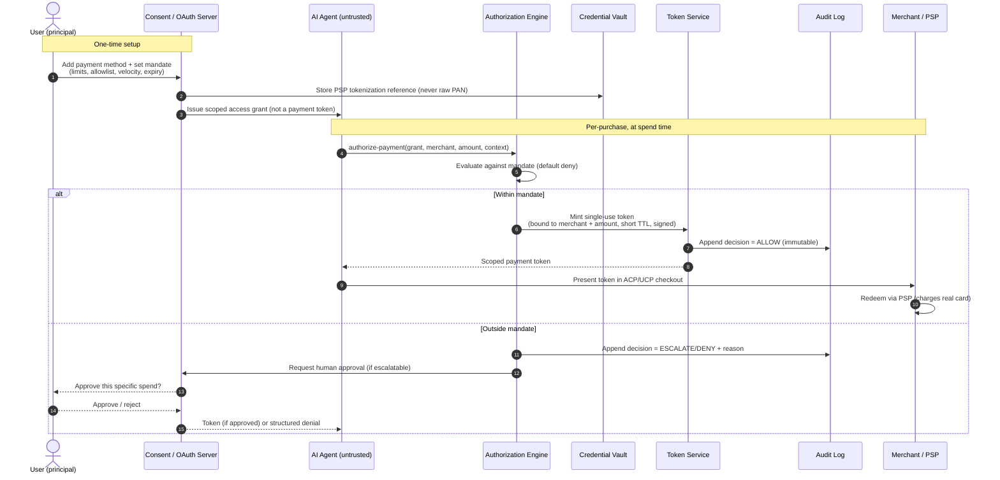
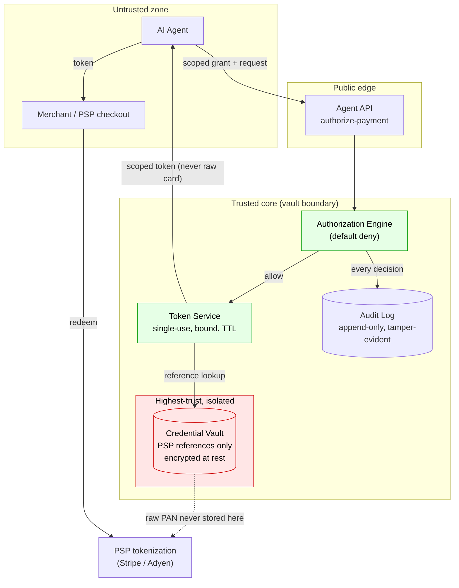

# Reference Architecture: Agentic Payments

> **Status: proposed / reference architecture.** This document refines and extends the
> top-level [`../ARCHITECTURE.md`](../ARCHITECTURE.md) into a cleaner reference design. It does
> not contradict it: the components, security posture, and integration points are the same, drawn
> as explicit flows with trust boundaries. Where the two differ, treat this document as the more
> current statement of intent. Nothing here is implemented.

---

## 1. Design goals

1. **The secret never reaches the agent.** An agent receives a scoped, expiring token, never a
   card number or a re-usable credential.
2. **Least privilege by construction.** A token can only ever do what the user's mandate allows.
   The default is deny.
3. **Revocation is real and instant.** Revoking access invalidates tokens server-side, not by
   asking the agent to please stop.
4. **Every decision is auditable.** Each authorization produces one immutable, tamper-evident
   log entry with enough context to reconstruct why a charge was allowed.
5. **Standards-fit.** Tokens drop into existing agent-commerce checkout flows (ACP `delegate_payment`,
   UCP tokenization handlers) rather than inventing a parallel rail.

---

## 2. Components (reference)

| Component | Responsibility | Trust tier |
|---|---|---|
| **Consent / OAuth server** | Runs the user's grant/revoke flow; issues and revokes agent access grants (scoped, not payment tokens) | Trusted core |
| **Credential vault** | Stores PSP tokenization *references* (never raw PANs); encrypted at rest; add/remove payment methods | Highest-trust, isolated |
| **Authorization engine** | Evaluates each payment request against the user's mandate (limits, allowlists, velocity, expiry); deterministic allow/deny with a machine-readable reason | Trusted core |
| **Token service** | Mints single-use, merchant+amount-bound, short-TTL, signed payment tokens after an allow decision | Trusted core |
| **Audit log** | Append-only, tamper-evident record of every decision and token use; powers the user dashboard | Trusted core, write-once |
| **Agent API** | The single public surface: `authorize-payment`; returns a token or a structured denial | Public edge |

The **trust boundary** is the line between the agent (untrusted) and everything inside the vault
core. The agent only ever touches the Agent API and receives constrained tokens. It never crosses
into the vault.

---

## 3. Diagram 1 — Delegation and authorization flow

How a mandate is set once, then how a single payment request is evaluated and either issued a
scoped token or escalated to the human.

Key properties visible in the flow: the agent's grant is not spendable on its own; every request
is re-evaluated at spend time; a denial is structured (the agent learns *why*, not just "no"); and
approvals for out-of-mandate spend are per-transaction, not a blanket raise of the limit.

---

## 4. Diagram 2 — Credential-vault trust boundary

Where secrets live, what crosses the boundary, and what never does.

What crosses the boundary **outward**: only scoped, single-use, bound tokens and structured
decisions. What never crosses outward: raw card numbers, re-usable credentials, or the vault's
contents. Raw PANs never enter the vault at all; the vault holds PSP tokenization references, so a
vault breach yields references, not spendable card numbers.

---

## 5. Reconciliation with the original architecture

The top-level [`../ARCHITECTURE.md`](../ARCHITECTURE.md) lists the same five core components
(OAuth server, credential vault, authorization engine, agent API, transaction log) and the same
security model (PSP tokenization, encrypted-at-rest, single-use bound tokens with short expiry,
full audit). This document adds:

- **Explicit trust tiers** and an isolated vault subzone.
- **Two rendered flows** (delegation/authorization sequence; vault trust boundary) in place of
  ASCII sketches.
- A sharper statement that the vault holds **references, not PANs**, so breach blast radius is bounded.
- A **default-deny** framing for the authorization engine and **structured denials** for agents.

Where the original states a specific parameter (for example, 90-day OAuth validity, 15-minute
payment-token expiry, AES-256 at rest), treat those as illustrative defaults from the design stage.
Concrete values would be set during the threat-model and security-review work described in
[TECHNICAL_NOTES.md](TECHNICAL_NOTES.md) and the roadmap in [PRD.md](PRD.md).

---

## 6. Integration points (ACP / UCP)

- **ACP (`delegate_payment`).** Agentic Payments acts as the credential vault the flow references:
  the agent presents its user grant, receives a merchant+amount-bound token, and submits it through
  ACP's delegate-payment step. This supplies the user-consent and authorization layer ACP assumes
  but does not define.
- **UCP tokenization handler.** Agentic Payments acts as the credential provider: a platform calls
  `authorize-payment`, receives a pre-authorized token, and submits it to UCP's tokenization handler
  to complete checkout. OAuth scopes extend to payment-credential management.

Neither integration replaces the protocol. Both fill the same gap: *how a user authorizes an agent
to reach payment credentials in the first place.* See [FDE_JOURNEY.md](FDE_JOURNEY.md) for how this
would land inside a live merchant/PSP environment.
